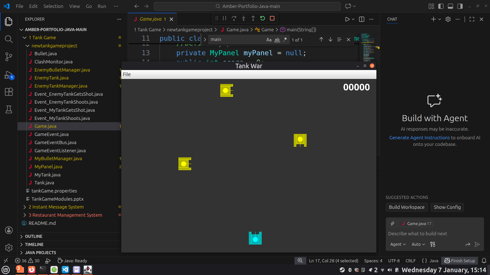

# Tank game
This is a tank game where the player controls a tank to fight multiple enemy tanks. Supports save and load.
  
Modules: Player Control; Enemy AI (randomly moves and shoots); Collision Detection; Rendering (with JPanel); Game State Management; Animation; Event Handling; Thread Management.
  
Screenshot:
  

  
To run the project, it's advised to open the project folder in an IDE, direct to `newtankgameproject/` and run `Game.java`.
  
To control the tank: Use arrow keys to move. Use "J" to shoot.
